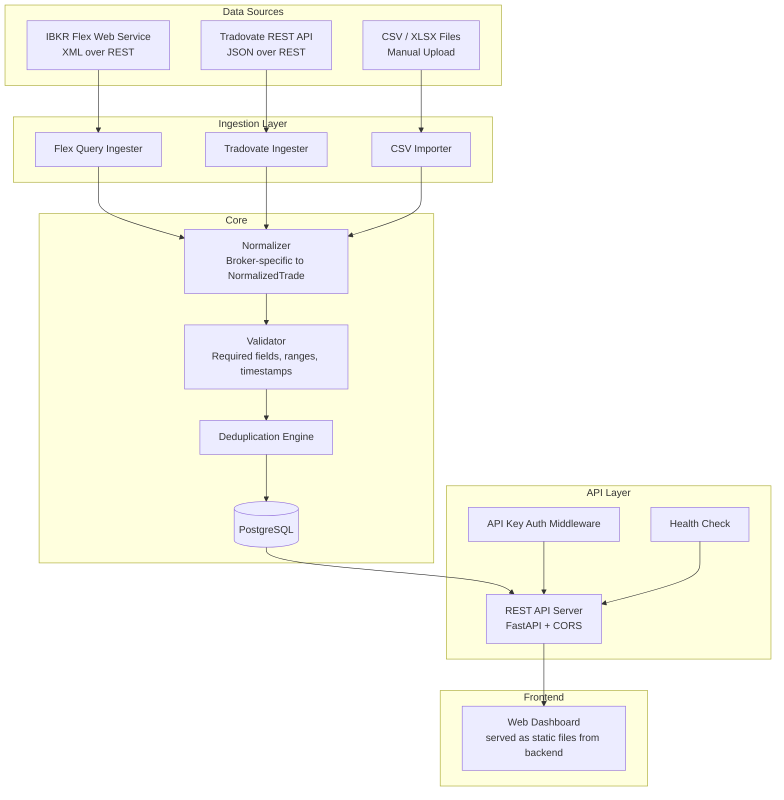
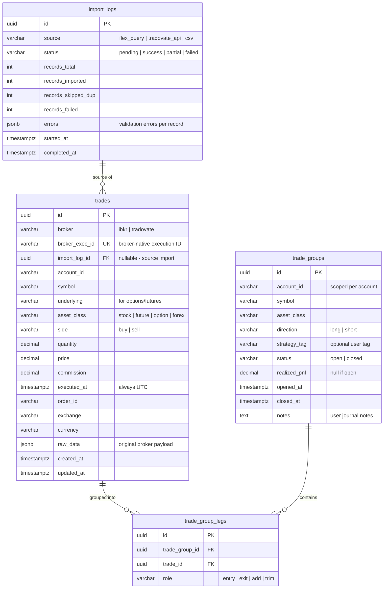
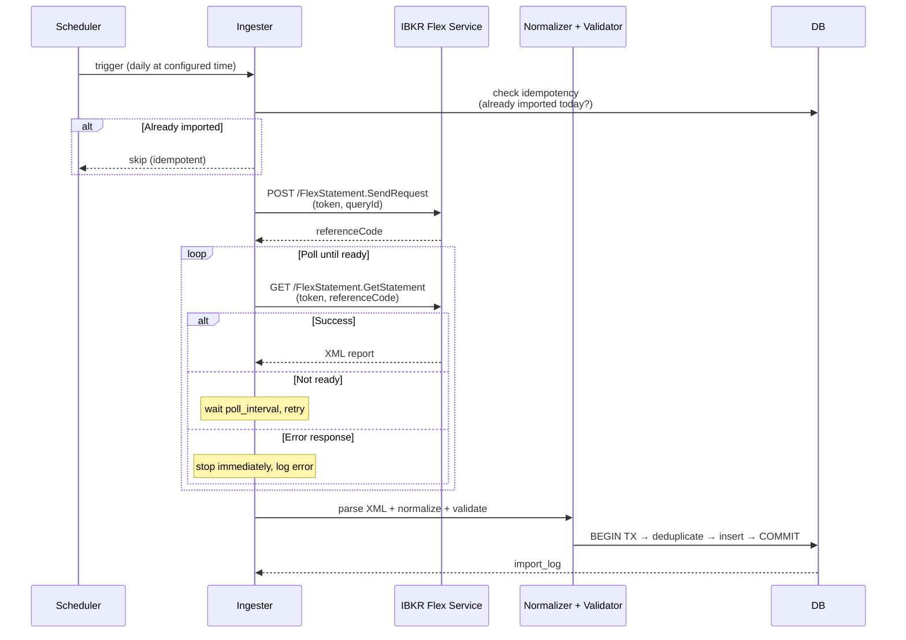
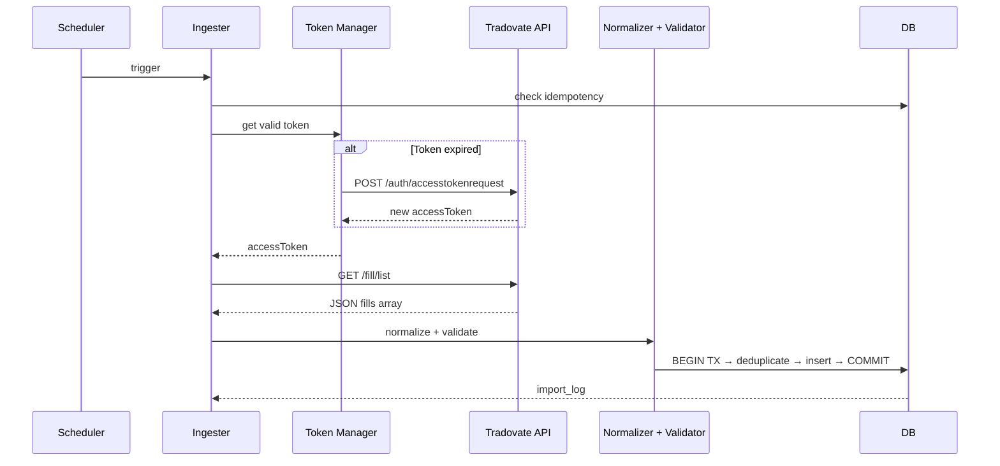

# Trading Records System — Design Document (Final)

> **Version:** 1.0-final  
> **Date:** 2026-02-18  
> **Status:** Reviewed and revised. Incorporates all recommendations from design review.

---

## 1. Goals and Constraints

**Primary Goal:** A self-hosted system that captures, normalizes, stores, and analyzes trading records from Interactive Brokers (IBKR) and Tradovate, with full data ownership.

**Design Principles:**
- Simple and reliable over clever and complex
- Batch-first, real-time later
- Store raw broker data alongside normalized data (never lose fidelity)
- Each component independently testable and replaceable
- All timestamps stored as UTC; display in user-local timezone
- Every import is an atomic database transaction

**Non-Goals (for v1):**
- Real-time WebSocket streaming
- Order placement or trade execution
- Mobile application
- Multi-user / multi-tenant

---

## 2. System Architecture



### Component Responsibilities

| Component | Responsibility |
|-----------|---------------|
| **Flex Query Ingester** | Two-step REST flow: request report, poll for completion (with circuit breaker), download XML, parse |
| **Tradovate Ingester** | OAuth token management, REST calls to `/fill/list` and `/position/list` |
| **CSV Importer** | Detect broker format, map columns, validate data |
| **Normalizer** | Transform broker-specific fields into `NormalizedTrade` Pydantic model |
| **Validator** | Required fields check, range validation, timestamp sanity |
| **Deduplication Engine** | Prevent duplicate trades on re-import using composite keys |
| **PostgreSQL** | Persistent storage with JSONB for raw data, materialized views for analytics |
| **API Key Auth** | Simple shared-secret API key middleware for v1 |
| **Health Check** | `GET /health` — verifies DB connectivity and service readiness |
| **REST API** | CRUD + query endpoints for trades, positions, analytics |
| **Web Dashboard** | P&L calendar, trade tables, charts, import UI (served as static files from FastAPI) |

---

## 3. Technology Stack

| Layer | Choice | Rationale |
|-------|--------|-----------|
| **Language** | Python 3.12+ | Best IBKR library ecosystem (ib_async, pandas), rapid development |
| **Dependency Mgmt** | uv | Faster than poetry, lockfile support, strong Docker build caching |
| **Web Framework** | FastAPI | Async support, auto-generated OpenAPI docs, Pydantic validation |
| **Database** | PostgreSQL 16 | JSONB for raw data, window functions for P&L, materialized views |
| **ORM / Query** | SQLAlchemy 2.0 + Alembic | Type-safe queries, migration management |
| **Frontend** | React + TypeScript | Component model, TradingView widget compatibility |
| **Charting** | Lightweight Charts (TradingView) + Recharts | Trade overlays on price charts + statistical charts |
| **Task Scheduling** | APScheduler (in-process) | Simple cron-like scheduling for Flex Query pulls. **Limitation:** job state lost on restart, no duplicate instance protection. Mitigated by idempotency check: skip scheduled run if an import already succeeded for the current date. Phase 2+ may migrate to PostgreSQL-backed job tracking. |
| **Logging** | structlog (JSON) | Structured logging for import events, errors, API latency |
| **Containerization** | Docker Compose | Single-command deployment: app + postgres |
| **CORS** | FastAPI CORSMiddleware | Allow `localhost` origins for development; configurable for production |

---

## 4. Unified Trade Data Schema

### 4.1 Core Tables



**Note on `net_amount`:** This field is intentionally omitted from the `trades` table. The net proceeds computation varies by asset class (equities vs options with multiplier vs futures) and trade side. It is computed dynamically in queries and views to avoid stale/inconsistent stored values.

### 4.2 Daily Summaries (Materialized View)

`daily_summaries` is a PostgreSQL **materialized view**, refreshed after each import operation:

```sql
CREATE MATERIALIZED VIEW daily_summaries AS
SELECT
    date_trunc('day', t.executed_at AT TIME ZONE 'UTC')::date AS date,
    t.account_id,
    SUM(CASE
        WHEN t.side = 'sell' THEN t.price * t.quantity
        WHEN t.side = 'buy' THEN -t.price * t.quantity
    END) AS gross_pnl,
    SUM(CASE
        WHEN t.side = 'sell' THEN t.price * t.quantity
        WHEN t.side = 'buy' THEN -t.price * t.quantity
    END) - SUM(ABS(t.commission)) AS net_pnl,
    SUM(ABS(t.commission)) AS commissions,
    COUNT(*) AS trade_count,
    COUNT(*) FILTER (WHERE t.side = 'sell' AND t.price * t.quantity > 0) AS win_count,
    COUNT(*) FILTER (WHERE t.side = 'sell' AND t.price * t.quantity <= 0) AS loss_count
FROM trades t
GROUP BY 1, 2;

CREATE UNIQUE INDEX ON daily_summaries (date, account_id);
```

Refresh via: `REFRESH MATERIALIZED VIEW CONCURRENTLY daily_summaries;`

### 4.3 Deduplication Strategy

Each trade is uniquely identified by a **composite natural key**:

```
(broker, broker_exec_id)
```

- **IBKR:** `broker_exec_id` = Flex Query `tradeID` field (unique per execution)
- **Tradovate:** `broker_exec_id` = fill `id` from `/fill/list` response
- **CSV:** `broker_exec_id` = SHA-256 hash of `(source_filename, row_number, symbol, side, qty, price, executed_at)` — includes source file name and row number to avoid collisions on legitimate duplicate executions (same price/time partial fills)

On import, the ingester checks for existing records with the same composite key. Duplicates are counted in `import_logs.records_skipped_dup` and silently skipped.

### 4.4 Trade Grouping Logic

Trades are grouped into **trade groups** (round trips) using FIFO matching. **Trade grouping is a standalone, re-runnable process, decoupled from the import pipeline.** It does not run during import. Instead, it is triggered separately:

- Automatically after each successful import (as a post-import step)
- Manually via `POST /api/v1/groups/recompute`
- On-demand per symbol: `POST /api/v1/groups/recompute?symbol=AAPL`

When triggered, the grouper recomputes groups for affected symbols from scratch (or from the earliest affected open group), ensuring correct grouping even when trades arrive out of order.

**FIFO Matching Rules:**

1. Group by `(account_id, symbol)` — grouping is always scoped per account.
2. Sort all trades by `executed_at` ascending.
3. A **BUY** without an open group → open a new **long** group (direction=long).
4. A **SELL** without an open group → open a new **short** group (direction=short).
5. A **SELL** with an open long group → match against the oldest open long group (FIFO).
6. A **BUY** with an open short group → match against the oldest open short group (FIFO).
7. When net quantity reaches zero, close the group and compute `realized_pnl`.
8. Partial closes create `trim` legs; adding to a position creates `add` legs.

Users can manually override grouping and attach `strategy_tag` and `notes`.

**Edge Cases (deferred to Phase 2+):**

| Case | Handling |
|------|----------|
| Options exercise/assignment | Treat as synthetic sell/buy; requires ingesting exercise records from Flex Query |
| Futures rollovers | Separate symbols = separate groups; manual linking via `strategy_tag` |
| Stock splits | Adjust quantity using corporate action data from Flex Query |
| Multi-leg options strategies | Each leg is a separate trade; group manually or via strategy tagging |

### 4.5 Index Plan

The following indexes are included in the initial Alembic migration:

```sql
-- Trade lookup by date range (most common query pattern)
CREATE INDEX idx_trades_executed_at ON trades (executed_at);

-- Filter by symbol within date range
CREATE INDEX idx_trades_symbol_executed_at ON trades (symbol, executed_at);

-- Filter by broker + account
CREATE INDEX idx_trades_broker_account ON trades (broker, account_id);

-- Dedup composite key (also serves as unique constraint)
CREATE UNIQUE INDEX idx_trades_broker_exec_id ON trades (broker, broker_exec_id);

-- Import log traceability
CREATE INDEX idx_trades_import_log_id ON trades (import_log_id);

-- Trade group status lookup
CREATE INDEX idx_trade_groups_status ON trade_groups (status);

-- Trade group by account + symbol (for grouping queries)
CREATE INDEX idx_trade_groups_account_symbol ON trade_groups (account_id, symbol);

-- Group legs lookup by group
CREATE INDEX idx_trade_group_legs_group_id ON trade_group_legs (trade_group_id);
```

### 4.6 Timezone Contract

**Rule:** All timestamps are stored as `timestamptz` (UTC) in PostgreSQL.

| Stage | Timezone Handling |
|-------|-------------------|
| **IBKR Flex Query** | `dateTime` field is in exchange timezone. Normalize to UTC using the `exchange` field to determine the source timezone. |
| **Tradovate API** | `timestamp` field is in UTC. Store directly. |
| **CSV Import** | Assume exchange timezone unless the CSV header specifies otherwise. Convert to UTC during normalization. |
| **API Response** | Return UTC timestamps in ISO 8601 format (`2025-01-15T14:30:00Z`). |
| **Frontend** | Convert UTC to user-local timezone for display using browser's `Intl.DateTimeFormat`. |

---

## 5. Data Ingestion Pipeline Design

### 5.0 Normalization Contract

All ingesters produce a `NormalizedTrade` Pydantic model as output. The deduplication engine only accepts this type. This ensures schema changes are explicit and caught by type checking.

```python
class NormalizedTrade(BaseModel):
    broker: Literal["ibkr", "tradovate"]
    broker_exec_id: str
    account_id: str
    symbol: str
    underlying: str | None
    asset_class: Literal["stock", "future", "option", "forex"]
    side: Literal["buy", "sell"]
    quantity: Decimal
    price: Decimal
    commission: Decimal
    executed_at: datetime  # must be UTC
    order_id: str | None
    exchange: str | None
    currency: str
    raw_data: dict  # original broker payload
```

### 5.1 Data Validation Rules

A validation step runs between normalization and deduplication. Invalid records are **not inserted** but are logged in `import_logs.errors` with details.

| Rule | Check |
|------|-------|
| **Required fields** | `symbol`, `price`, `quantity`, `executed_at`, `side`, `broker_exec_id` must be non-null |
| **Price range** | `price > 0` (except for certain forex/futures adjustments) |
| **Quantity range** | `quantity != 0` |
| **Timestamp sanity** | `executed_at` is not in the future; not before 2000-01-01 |
| **Broker enum** | `broker` must be one of `ibkr`, `tradovate` |
| **Asset class enum** | `asset_class` must be one of `stock`, `future`, `option`, `forex` |

### 5.2 Transaction Semantics

**Every import operation is wrapped in a single database transaction.** If any step fails after validation (dedup, insert), the entire batch rolls back. This ensures data consistency — no partial imports.

Flow:
1. Fetch raw data from broker API / parse CSV
2. Normalize each record → `NormalizedTrade`
3. Validate each record → collect valid records and validation errors
4. **BEGIN TRANSACTION**
5. Deduplicate valid records against existing data
6. Insert new records
7. Write `import_log` entry
8. **COMMIT** (or ROLLBACK on any failure)
9. Refresh materialized views (`daily_summaries`)
10. Trigger trade grouping recompute for affected symbols

Records that fail validation are recorded in `import_logs.errors` JSONB (with field-level details) **before** the transaction begins.

### 5.3 IBKR Flex Query Ingester



**Polling Circuit Breaker:**
- "Not ready" (status code indicates pending): continue polling, up to `poll_max_attempts`.
- Error response (HTTP 4xx/5xx, malformed XML): stop immediately, log error, mark import as failed.
- Exponential backoff on transient errors (503, timeout): wait 10s, 20s, 40s...

**Configuration:**
```yaml
ibkr:
  flex_token: "${IBKR_FLEX_TOKEN}"       # from env var
  query_id: "123456"                      # configured in IBKR Account Mgmt
  schedule: "0 6 * * *"                   # daily at 6 AM
  poll_interval_seconds: 10
  poll_max_attempts: 10
```

**Flex Query Setup Requirements:**
- User creates a Flex Query in IBKR Account Management
- Query must include: Trade Confirmations with all fields
- Token generated in Account Management > Settings > Flex Web Service

**Field Mapping (IBKR XML → NormalizedTrade):**

| Flex XML Field | NormalizedTrade Field | Notes |
|---------------|----------------------|-------|
| `tradeID` | `broker_exec_id` | |
| `accountId` | `account_id` | |
| `symbol` | `symbol` | |
| `underlyingSymbol` | `underlying` | |
| `assetCategory` | `asset_class` | Map: STK→stock, FUT→future, OPT→option, CASH→forex |
| `buySell` | `side` | Map: BUY→buy, SELL→sell |
| `quantity` | `quantity` | |
| `tradePrice` | `price` | |
| `ibCommission` | `commission` | |
| `dateTime` | `executed_at` | **Convert from exchange TZ to UTC** |
| `ibOrderID` | `order_id` | |
| `exchange` | `exchange` | |
| `currency` | `currency` | |
| (full XML node) | `raw_data` | Serialized as dict |

### 5.4 Tradovate REST Ingester



**Token Management:**
- Store encrypted token + expiration in local config
- Refresh proactively before expiration
- Respect rate limits on `/auth/accesstokenrequest`
- Separate config for live vs demo environments

**Configuration:**
```yaml
tradovate:
  environment: "live"                     # or "demo"
  username: "${TRADOVATE_USERNAME}"
  password: "${TRADOVATE_PASSWORD}"
  app_id: "trading-records"
  client_id: "${TRADOVATE_CLIENT_ID}"
  client_secret: "${TRADOVATE_CLIENT_SECRET}"
  device_id: "${TRADOVATE_DEVICE_ID}"     # generated once, stored
  schedule: "0 6 * * *"
```

> **Security Note:** Tradovate credentials are high-value. Use a dedicated API-only account if available, or at minimum a unique password not shared with other services. Consider environment-level isolation (run only in a trusted local environment).

**Field Mapping (Tradovate JSON → NormalizedTrade):**

| Tradovate Field | NormalizedTrade Field | Notes |
|----------------|----------------------|-------|
| `id` | `broker_exec_id` | |
| `accountId` | `account_id` | |
| `contractId` → contract lookup | `symbol` | Requires `/contract/item` lookup |
| (contract product) | `underlying` | |
| `"future"` (always) | `asset_class` | |
| `action` | `side` | Map: Buy→buy, Sell→sell |
| `qty` | `quantity` | |
| `price` | `price` | |
| `commission` | `commission` | From separate endpoint or computed |
| `timestamp` | `executed_at` | Already UTC, store directly |
| `orderId` | `order_id` | |
| `"TRADOVATE"` | `exchange` | |
| `"USD"` | `currency` | |
| (full JSON object) | `raw_data` | |

### 5.5 CSV Importer

**Supported Formats (v1):**
1. IBKR Activity Statement CSV (exported from Account Management)
2. Tradovate trade history CSV (exported from platform)
3. Generic format with configurable column mapping

**Detection Logic:**
- Check header row for known patterns
- IBKR CSVs start with `"Statement"` section headers
- Tradovate CSVs have columns: `orderId, execId, contractName, ...`
- If neither matches, fall back to user-provided column mapping

**Import Flow:**
1. Upload file via API or CLI
2. Detect format → select parser
3. Parse rows → normalize to `NormalizedTrade` (include source filename + row number in hash)
4. Validate all records
5. BEGIN TX → deduplicate → insert → COMMIT
6. Return import summary with error details

---

## 6. API Design

### 6.1 Endpoints

```
# Health
GET    /health                          # DB connectivity check (used by Docker healthcheck)

# Trades
GET    /api/v1/trades                   # list trades (paginated, filterable)
GET    /api/v1/trades/:id               # single trade detail
GET    /api/v1/trades/summary           # aggregated stats (date range, account)

# Trade Groups (round trips)
GET    /api/v1/groups                   # list trade groups
GET    /api/v1/groups/:id               # group detail with legs
PATCH  /api/v1/groups/:id              # update tags, notes
POST   /api/v1/groups/recompute        # recompute grouping (optional ?symbol= filter)

# Import
POST   /api/v1/import/csv              # upload CSV file
POST   /api/v1/import/flex/trigger      # manually trigger Flex Query
POST   /api/v1/import/tradovate/trigger # manually trigger Tradovate pull
GET    /api/v1/import/logs              # import history

# Analytics
GET    /api/v1/analytics/daily          # daily P&L summary (from materialized view)
GET    /api/v1/analytics/calendar       # monthly calendar data
GET    /api/v1/analytics/by-symbol      # per-symbol breakdown
GET    /api/v1/analytics/by-strategy    # per-strategy-tag breakdown
GET    /api/v1/analytics/performance    # win rate, expectancy, Sharpe, etc.

# Config
GET    /api/v1/config                   # current config (redacted secrets)
PUT    /api/v1/config                   # update config
```

### 6.2 Common Query Parameters

```
?account_id=U1234567          # filter by account
?broker=ibkr                  # filter by broker
?symbol=AAPL                  # filter by symbol
?asset_class=option           # filter by asset class
?from=2025-01-01&to=2025-12-31  # date range
?page=1&per_page=50           # pagination
?sort=executed_at&order=desc  # sorting
```

### 6.3 Authentication

v1 uses a simple **API Key** authentication middleware:

- A shared secret is stored in the `API_KEY` environment variable.
- All `/api/v1/*` endpoints require the header `X-API-Key: <key>`.
- `GET /health` is unauthenticated (for Docker healthcheck).
- If `API_KEY` is not set, authentication is disabled (local development convenience) with a startup warning.

```python
# Middleware pseudo-code
@app.middleware("http")
async def api_key_auth(request, call_next):
    if request.url.path == "/health":
        return await call_next(request)
    if settings.api_key:
        if request.headers.get("X-API-Key") != settings.api_key:
            return JSONResponse(status_code=401, content={"detail": "Invalid API key"})
    return await call_next(request)
```

### 6.4 CORS Configuration

```python
app.add_middleware(
    CORSMiddleware,
    allow_origins=settings.cors_origins,  # default: ["http://localhost:3000"]
    allow_methods=["*"],
    allow_headers=["*"],
)
```

Configurable via `CORS_ORIGINS` environment variable (comma-separated list).

---

## 7. Frontend Architecture

### 7.1 Page Structure

```
/                         → Dashboard (daily P&L calendar, key metrics)
/trades                   → Trade list (sortable, filterable table)
/trades/:id               → Trade detail
/groups                   → Trade groups / round trips
/groups/:id               → Group detail with entry/exit legs
/analytics                → Charts and statistics
/import                   → Import management (upload, trigger, logs)
/settings                 → Broker config, API keys, preferences
```

### 7.2 Dashboard Components

1. **P&L Calendar** — Monthly heatmap grid, green/red cells by daily P&L
2. **Equity Curve** — Cumulative P&L line chart
3. **Key Metrics Cards** — Total P&L, Win Rate, Profit Factor, Avg Win/Loss
4. **Recent Trades** — Last 10 trades table
5. **Per-Symbol Breakdown** — Horizontal bar chart of P&L by symbol

### 7.3 Frontend Tech

| Concern | Choice |
|---------|--------|
| Framework | React 18 + TypeScript |
| Routing | React Router v6 |
| State | TanStack Query (server state) + Zustand (UI state) |
| UI Components | shadcn/ui (Tailwind-based) |
| Tables | TanStack Table |
| Charts | Recharts (analytics) + Lightweight Charts (price charts) |
| Build | Vite |
| Timezone | `Intl.DateTimeFormat` for UTC → local display |

### 7.4 API Key Handling

The frontend stores the API key in `localStorage` and includes it in every request via the `X-API-Key` header. The settings page provides a field to configure the key.

---

## 8. Project Structure

```
trading-records/
├── docker-compose.yml
├── Dockerfile                   # Multi-stage: build frontend + backend
├── pyproject.toml               # Python project config (uv)
├── uv.lock                      # Pinned dependencies
├── alembic.ini                  # DB migration config
│
├── backend/
│   ├── __init__.py
│   ├── main.py                  # FastAPI app entry + static file mount
│   ├── config.py                # Settings (pydantic-settings)
│   ├── database.py              # SQLAlchemy engine + session
│   ├── auth.py                  # API key middleware
│   │
│   ├── models/                  # SQLAlchemy ORM models
│   │   ├── trade.py
│   │   ├── trade_group.py
│   │   └── import_log.py
│   │
│   ├── schemas/                 # Pydantic request/response schemas
│   │   ├── trade.py             # includes NormalizedTrade
│   │   ├── analytics.py
│   │   └── import_result.py
│   │
│   ├── api/                     # API route handlers
│   │   ├── health.py
│   │   ├── trades.py
│   │   ├── groups.py
│   │   ├── analytics.py
│   │   └── imports.py
│   │
│   ├── ingestion/               # Data ingestion pipelines
│   │   ├── base.py              # Abstract ingester interface
│   │   ├── ibkr_flex.py         # IBKR Flex Query ingester
│   │   ├── tradovate.py         # Tradovate REST ingester
│   │   ├── csv_importer.py      # CSV/XLSX importer
│   │   ├── normalizer.py        # Broker → NormalizedTrade mapping
│   │   └── validator.py         # Data validation rules
│   │
│   ├── services/                # Business logic
│   │   ├── trade_grouper.py     # FIFO round-trip matching (standalone)
│   │   ├── analytics.py         # Stats computation
│   │   └── scheduler.py         # APScheduler setup
│   │
│   └── migrations/              # Alembic migrations
│       └── versions/
│
├── frontend/
│   ├── package.json
│   ├── vite.config.ts
│   ├── src/
│   │   ├── App.tsx
│   │   ├── pages/
│   │   ├── components/
│   │   ├── hooks/
│   │   └── api/                 # API client (generated from OpenAPI)
│   └── public/
│
├── tests/
│   ├── fixtures/                # Sample data for testing
│   │   ├── ibkr_flex_sample.xml
│   │   ├── tradovate_fills.json
│   │   ├── ibkr_activity.csv
│   │   └── tradovate_export.csv
│   ├── test_ibkr_flex.py
│   ├── test_tradovate.py
│   ├── test_csv_importer.py
│   ├── test_normalizer.py
│   ├── test_validator.py
│   ├── test_trade_grouper.py
│   └── test_api/
│
└── config/
    └── config.example.yaml      # Example config with all options
```

---

## 9. Deployment

### Docker Compose (Primary)

```yaml
# docker-compose.yml
services:
  db:
    image: postgres:16-alpine
    volumes:
      - pgdata:/var/lib/postgresql/data
    environment:
      POSTGRES_DB: trading_records
      POSTGRES_USER: ${DB_USER}
      POSTGRES_PASSWORD: ${DB_PASSWORD}
    # No host port exposure — only accessible via Docker network
    healthcheck:
      test: ["CMD-SHELL", "pg_isready -U ${DB_USER} -d trading_records"]
      interval: 10s
      timeout: 5s
      retries: 5

  app:
    build: .
    depends_on:
      db:
        condition: service_healthy
    environment:
      DATABASE_URL: postgresql://${DB_USER}:${DB_PASSWORD}@db:5432/trading_records
      IBKR_FLEX_TOKEN: ${IBKR_FLEX_TOKEN}
      TRADOVATE_USERNAME: ${TRADOVATE_USERNAME}
      TRADOVATE_PASSWORD: ${TRADOVATE_PASSWORD}
      TRADOVATE_CLIENT_ID: ${TRADOVATE_CLIENT_ID}
      TRADOVATE_CLIENT_SECRET: ${TRADOVATE_CLIENT_SECRET}
      TRADOVATE_DEVICE_ID: ${TRADOVATE_DEVICE_ID}
      API_KEY: ${API_KEY}
      CORS_ORIGINS: ${CORS_ORIGINS:-http://localhost:8000}
    ports:
      - "127.0.0.1:8000:8000"
    healthcheck:
      test: ["CMD", "curl", "-f", "http://localhost:8000/health"]
      interval: 30s
      timeout: 10s
      retries: 3

volumes:
  pgdata:
```

**Key security measures:**
- `app` port bound to `127.0.0.1` only — not accessible from other machines on the network
- `db` has no host port mapping — only reachable from within the Docker network
- All secrets via `.env` file (not checked into git)
- Healthchecks ensure dependent services wait for actual readiness

### Multi-stage Dockerfile

```dockerfile
# Stage 1: Build frontend
FROM node:20-alpine AS frontend-build
WORKDIR /app/frontend
COPY frontend/package.json frontend/package-lock.json ./
RUN npm ci
COPY frontend/ ./
RUN npm run build

# Stage 2: Python app
FROM python:3.12-slim
WORKDIR /app

# Install uv
COPY --from=ghcr.io/astral-sh/uv:latest /uv /usr/local/bin/uv

# Install dependencies
COPY pyproject.toml uv.lock ./
RUN uv sync --frozen --no-dev

# Copy backend code
COPY backend/ ./backend/
COPY alembic.ini ./
COPY config/ ./config/

# Copy frontend build output
COPY --from=frontend-build /app/frontend/dist ./static/

EXPOSE 8000
CMD ["uv", "run", "uvicorn", "backend.main:app", "--host", "0.0.0.0", "--port", "8000"]
```

**Startup:** `docker compose up -d`

---

## 10. Implementation Phases

### Phase 1: Core Data Pipeline (MVP)

- [ ] PostgreSQL schema + Alembic migrations (with indexes)
- [ ] `NormalizedTrade` Pydantic model
- [ ] Data validation layer
- [ ] IBKR Flex Query ingester (scheduled + manual trigger + circuit breaker)
- [ ] CSV importer (IBKR Activity Statement format)
- [ ] Normalizer + deduplication (with transaction wrapping)
- [ ] API key authentication middleware
- [ ] `GET /health` endpoint
- [ ] CORS configuration
- [ ] Basic REST API (trades list, import endpoints)
- [ ] Minimal frontend: trade table + CSV upload (served from backend)
- [ ] Docker Compose with healthchecks and 127.0.0.1 binding
- [ ] structlog setup for import/API logging

### Phase 2: Tradovate + Analytics

- [ ] Tradovate REST ingester with OAuth token management
- [ ] Tradovate CSV import support
- [ ] Trade grouping (standalone FIFO round-trip matching with recompute endpoint)
- [ ] Daily summary materialized view + refresh logic
- [ ] Analytics API endpoints
- [ ] Dashboard: P&L calendar, equity curve, key metrics

### Phase 3: Enhanced UX

- [ ] Per-symbol and per-strategy analytics
- [ ] Trade journal notes and strategy tagging
- [ ] Sortable/filterable trade table with TanStack Table
- [ ] Price charts with trade overlays (Lightweight Charts)
- [ ] Import history and error reporting UI

### Phase 4: Real-time (Future)

- [ ] IBKR Client Portal API integration (via IBind pattern)
- [ ] Tradovate WebSocket streaming
- [ ] Live position and P&L updates
- [ ] Notification system
- [ ] PostgreSQL-backed scheduler (replace in-process APScheduler)

---

## 11. Key Design Decisions

| Decision | Choice | Rationale |
|----------|--------|-----------|
| Primary IBKR data source | Flex Web Service | No gateway needed, static token auth, up to 365 days history |
| Database | PostgreSQL | JSONB for raw data, window functions for analytics, materialized views, mature ecosystem |
| Backend language | Python | Best IBKR library support, pandas for analysis, FastAPI for modern API |
| Dependency management | uv | Fast, lockfile support, reproducible builds, Docker-friendly |
| Frontend framework | React + TypeScript | Component model, TradingView compatibility, large ecosystem |
| Frontend serving | Static files from FastAPI | Single container deployment, simpler ops, lower resource usage |
| Deduplication | Composite natural key per broker | Allows safe re-import without duplicates |
| Trade grouping | Standalone FIFO matching | Decoupled from import, re-runnable, handles out-of-order imports |
| Raw data storage | JSONB column on trades table | Preserves full broker data for debugging and reprocessing |
| P&L computation | Dynamic (not stored) | Avoids stale values; varies by asset class and side |
| Timestamps | UTC (timestamptz) | Consistent storage; convert at display time |
| Import atomicity | Database transaction per import | All-or-nothing; dedup makes re-import safe |
| Config management | YAML file + env vars for secrets | Simple, 12-factor compatible |
| Scheduling | APScheduler in-process + idempotency check | No external dependency for v1; skip if already imported today |
| Auth (app-level) | API Key via `X-API-Key` header | Low-effort protection; prevents accidental network exposure |
| Logging | structlog (JSON) | Structured, queryable, production-ready |

---

## 12. Backup Strategy

Trading records have legal/tax implications. Backups are essential.

### v1: pg_dump Script

```bash
#!/bin/bash
# backup.sh — run via cron: 0 2 * * * /path/to/backup.sh
BACKUP_DIR="/path/to/backups"
TIMESTAMP=$(date +%Y%m%d_%H%M%S)
docker compose exec -T db pg_dump -U ${DB_USER} trading_records \
    | gzip > "${BACKUP_DIR}/trading_records_${TIMESTAMP}.sql.gz"
# Retain last 30 days
find "${BACKUP_DIR}" -name "*.sql.gz" -mtime +30 -delete
```

### Recommendations

- Run `pg_dump` daily via host cron to a directory **outside** the Docker volume.
- Store backups on a separate physical disk or cloud storage.
- Test restore periodically: `gunzip < backup.sql.gz | docker compose exec -T db psql -U ${DB_USER} trading_records`
- Phase 2+: consider WAL archiving for point-in-time recovery.

---

## 13. Logging and Observability

### Logging Strategy

Use `structlog` with JSON output for structured, queryable logs.

**Log events (minimum):**

| Event | Level | Fields |
|-------|-------|--------|
| Import started | INFO | `source`, `broker`, `triggered_by` (schedule/manual) |
| Import completed | INFO | `source`, `records_total`, `records_imported`, `records_skipped_dup`, `records_failed`, `duration_ms` |
| Validation error | WARNING | `source`, `row`, `field`, `value`, `reason` |
| Normalization error | ERROR | `source`, `row`, `raw_data_snippet`, `error` |
| Dedup skip | DEBUG | `broker`, `broker_exec_id` |
| Flex Query poll | DEBUG | `attempt`, `status`, `reference_code` |
| Token refresh | INFO | `broker`, `expires_at` |
| API request | INFO | `method`, `path`, `status_code`, `duration_ms` |
| Scheduler job | INFO | `job_name`, `action` (start/complete/skip) |

**Configuration:**
```python
import structlog

structlog.configure(
    processors=[
        structlog.processors.TimeStamper(fmt="iso"),
        structlog.processors.add_log_level,
        structlog.processors.JSONRenderer(),
    ],
)
```

Logs are written to stdout (Docker standard), viewable via `docker compose logs app`.

---

## 14. Testing Strategy

### Test Layers

| Layer | Scope | Tools |
|-------|-------|-------|
| **Unit tests** | Normalizer mappings, validation rules, dedup logic, FIFO grouping algorithm | pytest |
| **Integration tests** | Ingesters with mock HTTP responses | pytest + respx (httpx mocking) |
| **API tests** | Full endpoint testing with test database | FastAPI TestClient + testcontainers-postgres |
| **Fixture data** | Sample broker data files | `tests/fixtures/` directory |

### Critical Test Cases

- **Normalizer:** Verify correct field mapping for each broker (IBKR XML, Tradovate JSON, CSV).
- **Validator:** Verify rejection of invalid records (null price, future timestamps, etc.).
- **Dedup:** Verify exact duplicates are skipped; verify near-duplicates are inserted.
- **FIFO Grouper:** Long open/close, short open/close, partial fills, add/trim legs, out-of-order trades.
- **Transaction rollback:** Verify no records persist when import fails mid-batch.
- **CSV format detection:** Verify correct parser selection for IBKR, Tradovate, and unknown formats.

### Running Tests

```bash
# Unit + integration tests
uv run pytest tests/ -v

# With coverage
uv run pytest tests/ --cov=backend --cov-report=term-missing
```

---

## 15. Risks and Mitigations

| Risk | Impact | Mitigation |
|------|--------|------------|
| IBKR Flex Query API changes or downtime | Data ingestion failure | CSV import as fallback; idempotency check; circuit breaker on polling; alert on failure |
| Tradovate token refresh rate limiting | Auth failures | Cache tokens aggressively; exponential backoff; store token with expiry |
| CME real-time data licensing costs | Budget impact (Phase 4) | Defer real-time to Phase 4; use end-of-day data for v1 |
| Tradovate Python ecosystem immaturity | Extra development effort | Build minimal focused client; only implement endpoints we need |
| Trade grouping edge cases (partial fills, exercises, rollovers) | Incorrect P&L | Allow manual group override; log grouping decisions; re-runnable grouper |
| CSV format variations across broker versions | Import failures | Flexible column mapping; format detection with fallback to manual mapping |
| Timezone inconsistencies across brokers | Incorrect time ordering and grouping | UTC normalization contract; explicit timezone mapping per exchange |
| Schema evolution breaking data | Data loss or corruption | Alembic migrations; raw_data JSONB enables full reprocessing from source; document re-import procedure |
| Accidental network exposure of trading data | Security breach | 127.0.0.1 port binding; API key auth; no DB port exposure |

---

## Appendix: Review Incorporation Checklist

| # | Review Item | Status | Section |
|---|-------------|--------|---------|
| 1 | Bind Docker ports to 127.0.0.1 | Done | 9 |
| 2 | Add import_log_id FK to trades | Done | 4.1 |
| 3 | Add index plan | Done | 4.5 |
| 4 | Specify UTC timezone handling | Done | 4.6 |
| 5 | Wrap imports in database transactions | Done | 5.2 |
| 6 | Add basic auth middleware (API key) | Done | 6.3 |
| 7 | Add /health + Docker healthchecks | Done | 6.1, 9 |
| 8 | Decouple trade grouping | Done | 4.4 |
| 9 | Add data validation layer | Done | 5.1 |
| 10 | Remove net_amount | Done | 4.1 note |
| 11 | Use materialized view for daily_summaries | Done | 4.2 |
| 12 | Add CORS configuration | Done | 6.4 |
| 13 | Serve frontend from backend | Done | 8, 9 |
| 14 | APScheduler idempotency | Done | 3, 5.3 |
| 15 | Backup strategy | Done | 12 |
| 16 | Structured logging | Done | 13 |
| 17 | Flex Query polling circuit breaker | Done | 5.3 |
| 18 | CSV dedup hash includes row number | Done | 4.3 |
| — | NormalizedTrade Pydantic contract | Done | 5.0 |
| — | Trade Grouping edge cases specification | Done | 4.4 |
| — | Dependency management = uv | Done | 3, 8 |
| — | Testing strategy | Done | 14 |
| — | Tradovate credential security note | Done | 5.4 |
| — | Schema migration strategy | Done | 15 |
