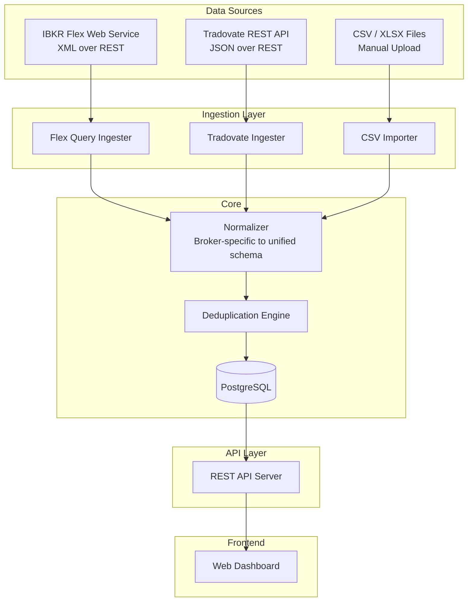
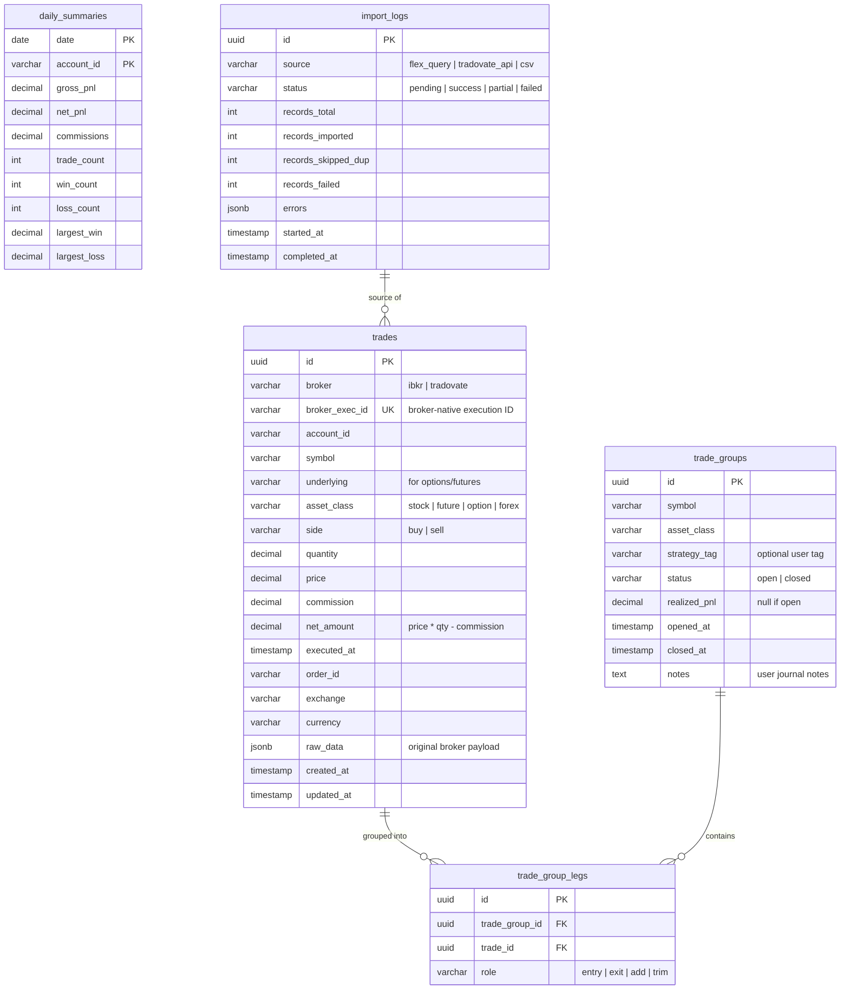
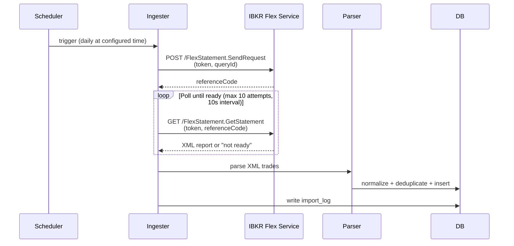
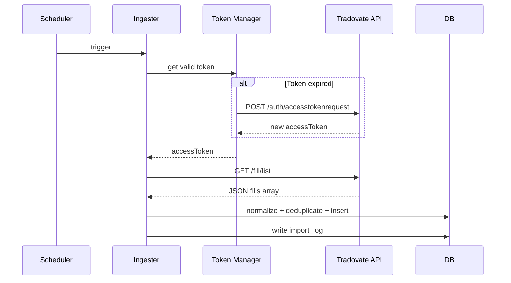

# Trading Records System — Design Document

## 1. Goals and Constraints

**Primary Goal:** A self-hosted system that captures, normalizes, stores, and analyzes trading records from Interactive Brokers (IBKR) and Tradovate, with full data ownership.

**Design Principles:**
- Simple and reliable over clever and complex
- Batch-first, real-time later
- Store raw broker data alongside normalized data (never lose fidelity)
- Each component independently testable and replaceable

**Non-Goals (for v1):**
- Real-time WebSocket streaming
- Order placement or trade execution
- Mobile application
- Multi-user / multi-tenant

---

## 2. System Architecture



### Component Responsibilities

| Component | Responsibility |
|-----------|---------------|
| **Flex Query Ingester** | Two-step REST flow: request report, poll for completion, download XML, parse |
| **Tradovate Ingester** | OAuth token management, REST calls to `/fill/list` and `/position/list` |
| **CSV Importer** | Detect broker format, map columns, validate data |
| **Normalizer** | Transform broker-specific fields into unified trade schema |
| **Deduplication Engine** | Prevent duplicate trades on re-import using composite keys |
| **PostgreSQL** | Persistent storage with JSONB for raw data, materialized views for analytics |
| **REST API** | CRUD + query endpoints for trades, positions, analytics |
| **Web Dashboard** | P&L calendar, trade tables, charts, import UI |

---

## 3. Technology Stack

| Layer | Choice | Rationale |
|-------|--------|-----------|
| **Language** | Python 3.12+ | Best IBKR library ecosystem (ib_async, pandas), rapid development |
| **Web Framework** | FastAPI | Async support, auto-generated OpenAPI docs, Pydantic validation |
| **Database** | PostgreSQL 16 | JSONB for raw data, window functions for P&L, materialized views |
| **ORM / Query** | SQLAlchemy 2.0 + Alembic | Type-safe queries, migration management |
| **Frontend** | React + TypeScript | Component model, TradingView widget compatibility |
| **Charting** | Lightweight Charts (TradingView) + Recharts | Trade overlays on price charts + statistical charts |
| **Task Scheduling** | APScheduler (in-process) | Simple cron-like scheduling for Flex Query pulls, no external dependency |
| **Containerization** | Docker Compose | Single-command deployment: app + postgres |

---

## 4. Unified Trade Data Schema

### 4.1 Core Tables



### 4.2 Deduplication Strategy

Each trade is uniquely identified by a **composite natural key**:

```
(broker, broker_exec_id)
```

- **IBKR:** `broker_exec_id` = Flex Query `tradeID` field (unique per execution)
- **Tradovate:** `broker_exec_id` = fill `id` from `/fill/list` response
- **CSV:** `broker_exec_id` = SHA-256 hash of `(symbol, side, qty, price, executed_at)` — fallback when no native ID exists

On import, the ingester checks for existing records with the same composite key. Duplicates are counted in `import_logs.records_skipped_dup` and silently skipped.

### 4.3 Trade Grouping Logic

Trades are grouped into **trade groups** (round trips) using FIFO matching:

1. When a BUY executes, open a new group (or add to existing open group for that symbol)
2. When a SELL executes, match against the oldest open group for that symbol
3. When net quantity reaches zero, close the group and compute `realized_pnl`
4. Partial closes create `trim` legs; adding to a position creates `add` legs

Users can manually override grouping and attach `strategy_tag` and `notes`.

---

## 5. Data Ingestion Pipeline Design

### 5.1 IBKR Flex Query Ingester



**Configuration:**
```yaml
ibkr:
  flex_token: "${IBKR_FLEX_TOKEN}"       # from env var
  query_id: "123456"                      # configured in IBKR Account Mgmt
  schedule: "0 6 * * *"                   # daily at 6 AM
  poll_interval_seconds: 10
  poll_max_attempts: 10
```

**Flex Query Setup Requirements:**
- User creates a Flex Query in IBKR Account Management
- Query must include: Trade Confirmations with all fields
- Token generated in Account Management > Settings > Flex Web Service

**Field Mapping (IBKR XML → Unified Schema):**

| Flex XML Field | Unified Field |
|---------------|---------------|
| `tradeID` | `broker_exec_id` |
| `accountId` | `account_id` |
| `symbol` | `symbol` |
| `underlyingSymbol` | `underlying` |
| `assetCategory` | `asset_class` (mapped) |
| `buySell` | `side` |
| `quantity` | `quantity` |
| `tradePrice` | `price` |
| `ibCommission` | `commission` |
| `dateTime` | `executed_at` |
| `ibOrderID` | `order_id` |
| `exchange` | `exchange` |
| `currency` | `currency` |
| (full XML node) | `raw_data` |

### 5.2 Tradovate REST Ingester



**Token Management:**
- Store encrypted token + expiration in local config
- Refresh proactively before expiration
- Respect rate limits on `/auth/accesstokenrequest`
- Separate config for live vs demo environments

**Configuration:**
```yaml
tradovate:
  environment: "live"                     # or "demo"
  username: "${TRADOVATE_USERNAME}"
  password: "${TRADOVATE_PASSWORD}"
  app_id: "trading-records"
  client_id: "${TRADOVATE_CLIENT_ID}"
  client_secret: "${TRADOVATE_CLIENT_SECRET}"
  device_id: "${TRADOVATE_DEVICE_ID}"     # generated once, stored
  schedule: "0 6 * * *"
```

**Field Mapping (Tradovate JSON → Unified Schema):**

| Tradovate Field | Unified Field |
|----------------|---------------|
| `id` | `broker_exec_id` |
| `accountId` | `account_id` |
| `contractId` → contract lookup | `symbol` |
| (contract product) | `underlying` |
| `"future"` (always) | `asset_class` |
| `action` | `side` (mapped: Buy/Sell) |
| `qty` | `quantity` |
| `price` | `price` |
| `commission` (from separate endpoint or computed) | `commission` |
| `timestamp` | `executed_at` |
| `orderId` | `order_id` |
| `"TRADOVATE"` | `exchange` |
| `"USD"` | `currency` |
| (full JSON object) | `raw_data` |

### 5.3 CSV Importer

**Supported Formats (v1):**
1. IBKR Activity Statement CSV (exported from Account Management)
2. Tradovate trade history CSV (exported from platform)
3. Generic format with configurable column mapping

**Detection Logic:**
- Check header row for known patterns
- IBKR CSVs start with `"Statement"` section headers
- Tradovate CSVs have columns: `orderId, execId, contractName, ...`
- If neither matches, fall back to user-provided column mapping

**Import Flow:**
1. Upload file via API or CLI
2. Detect format → select parser
3. Parse rows → validate required fields
4. Normalize → deduplicate → insert
5. Return import summary with error details

---

## 6. API Design

### 6.1 Endpoints

```
# Trades
GET    /api/v1/trades                 # list trades (paginated, filterable)
GET    /api/v1/trades/:id             # single trade detail
GET    /api/v1/trades/summary         # aggregated stats (date range, account)

# Trade Groups (round trips)
GET    /api/v1/groups                 # list trade groups
GET    /api/v1/groups/:id             # group detail with legs
PATCH  /api/v1/groups/:id             # update tags, notes
POST   /api/v1/groups/:id/regroup     # manually regroup trades

# Import
POST   /api/v1/import/csv             # upload CSV file
POST   /api/v1/import/flex/trigger     # manually trigger Flex Query
POST   /api/v1/import/tradovate/trigger # manually trigger Tradovate pull
GET    /api/v1/import/logs             # import history

# Analytics
GET    /api/v1/analytics/daily         # daily P&L summary
GET    /api/v1/analytics/calendar      # monthly calendar data
GET    /api/v1/analytics/by-symbol     # per-symbol breakdown
GET    /api/v1/analytics/by-strategy   # per-strategy-tag breakdown
GET    /api/v1/analytics/performance   # win rate, expectancy, Sharpe, etc.

# Config
GET    /api/v1/config                  # current config (redacted secrets)
PUT    /api/v1/config                  # update config
```

### 6.2 Common Query Parameters

```
?account_id=U1234567          # filter by account
?broker=ibkr                  # filter by broker
?symbol=AAPL                  # filter by symbol
?asset_class=option           # filter by asset class
?from=2025-01-01&to=2025-12-31  # date range
?page=1&per_page=50           # pagination
?sort=executed_at&order=desc  # sorting
```

---

## 7. Frontend Architecture

### 7.1 Page Structure

```
/                         → Dashboard (daily P&L calendar, key metrics)
/trades                   → Trade list (sortable, filterable table)
/trades/:id               → Trade detail
/groups                   → Trade groups / round trips
/groups/:id               → Group detail with entry/exit legs
/analytics                → Charts and statistics
/import                   → Import management (upload, trigger, logs)
/settings                 → Broker config, API keys, preferences
```

### 7.2 Dashboard Components

1. **P&L Calendar** — Monthly heatmap grid, green/red cells by daily P&L
2. **Equity Curve** — Cumulative P&L line chart
3. **Key Metrics Cards** — Total P&L, Win Rate, Profit Factor, Avg Win/Loss
4. **Recent Trades** — Last 10 trades table
5. **Per-Symbol Breakdown** — Horizontal bar chart of P&L by symbol

### 7.3 Frontend Tech

| Concern | Choice |
|---------|--------|
| Framework | React 18 + TypeScript |
| Routing | React Router v6 |
| State | TanStack Query (server state) + Zustand (UI state) |
| UI Components | shadcn/ui (Tailwind-based) |
| Tables | TanStack Table |
| Charts | Recharts (analytics) + Lightweight Charts (price charts) |
| Build | Vite |

---

## 8. Project Structure

```
trading-records/
├── docker-compose.yml
├── pyproject.toml                # Python project config (uv/poetry)
├── alembic.ini                   # DB migration config
│
├── backend/
│   ├── __init__.py
│   ├── main.py                   # FastAPI app entry
│   ├── config.py                 # Settings (pydantic-settings)
│   ├── database.py               # SQLAlchemy engine + session
│   │
│   ├── models/                   # SQLAlchemy ORM models
│   │   ├── trade.py
│   │   ├── trade_group.py
│   │   ├── daily_summary.py
│   │   └── import_log.py
│   │
│   ├── schemas/                  # Pydantic request/response schemas
│   │   ├── trade.py
│   │   ├── analytics.py
│   │   └── import_result.py
│   │
│   ├── api/                      # API route handlers
│   │   ├── trades.py
│   │   ├── groups.py
│   │   ├── analytics.py
│   │   └── imports.py
│   │
│   ├── ingestion/                # Data ingestion pipelines
│   │   ├── base.py               # Abstract ingester interface
│   │   ├── ibkr_flex.py          # IBKR Flex Query ingester
│   │   ├── tradovate.py          # Tradovate REST ingester
│   │   ├── csv_importer.py       # CSV/XLSX importer
│   │   └── normalizer.py         # Broker → unified schema mapping
│   │
│   ├── services/                 # Business logic
│   │   ├── trade_grouper.py      # FIFO round-trip matching
│   │   ├── analytics.py          # Stats computation
│   │   └── scheduler.py          # APScheduler setup
│   │
│   └── migrations/               # Alembic migrations
│       └── versions/
│
├── frontend/
│   ├── package.json
│   ├── vite.config.ts
│   ├── src/
│   │   ├── App.tsx
│   │   ├── pages/
│   │   ├── components/
│   │   ├── hooks/
│   │   └── api/                  # API client (generated from OpenAPI)
│   └── public/
│
├── tests/
│   ├── test_ibkr_flex.py
│   ├── test_tradovate.py
│   ├── test_csv_importer.py
│   ├── test_normalizer.py
│   ├── test_trade_grouper.py
│   └── test_api/
│
└── config/
    └── config.example.yaml       # Example config with all options
```

---

## 9. Deployment

### Docker Compose (Primary)

```yaml
# docker-compose.yml
services:
  db:
    image: postgres:16-alpine
    volumes:
      - pgdata:/var/lib/postgresql/data
    environment:
      POSTGRES_DB: trading_records
      POSTGRES_USER: ${DB_USER}
      POSTGRES_PASSWORD: ${DB_PASSWORD}
    ports:
      - "5432:5432"

  backend:
    build: .
    depends_on:
      - db
    environment:
      DATABASE_URL: postgresql://${DB_USER}:${DB_PASSWORD}@db:5432/trading_records
      IBKR_FLEX_TOKEN: ${IBKR_FLEX_TOKEN}
      TRADOVATE_USERNAME: ${TRADOVATE_USERNAME}
      # ... other secrets from .env
    ports:
      - "8000:8000"

  frontend:
    build: ./frontend
    depends_on:
      - backend
    ports:
      - "3000:3000"

volumes:
  pgdata:
```

**Startup:** `docker compose up -d`

All secrets via `.env` file (not checked into git).

---

## 10. Implementation Phases

### Phase 1: Core Data Pipeline (MVP)

- [ ] PostgreSQL schema + Alembic migrations
- [ ] IBKR Flex Query ingester (scheduled + manual trigger)
- [ ] CSV importer (IBKR Activity Statement format)
- [ ] Normalizer + deduplication
- [ ] Basic REST API (trades list, import endpoints)
- [ ] Minimal frontend: trade table + CSV upload

### Phase 2: Tradovate + Analytics

- [ ] Tradovate REST ingester with OAuth token management
- [ ] Tradovate CSV import support
- [ ] Trade grouping (FIFO round-trip matching)
- [ ] Daily summary materialized views
- [ ] Analytics API endpoints
- [ ] Dashboard: P&L calendar, equity curve, key metrics

### Phase 3: Enhanced UX

- [ ] Per-symbol and per-strategy analytics
- [ ] Trade journal notes and strategy tagging
- [ ] Sortable/filterable trade table with TanStack Table
- [ ] Price charts with trade overlays (Lightweight Charts)
- [ ] Import history and error reporting UI

### Phase 4: Real-time (Future)

- [ ] IBKR Client Portal API integration (via IBind pattern)
- [ ] Tradovate WebSocket streaming
- [ ] Live position and P&L updates
- [ ] Notification system

---

## 11. Key Design Decisions

| Decision | Choice | Rationale |
|----------|--------|-----------|
| Primary IBKR data source | Flex Web Service | No gateway needed, static token auth, up to 365 days history |
| Database | PostgreSQL | JSONB for raw data, window functions for analytics, mature ecosystem |
| Backend language | Python | Best IBKR library support, pandas for analysis, FastAPI for modern API |
| Frontend framework | React + TypeScript | Component model, TradingView compatibility, large ecosystem |
| Deduplication | Composite natural key per broker | Allows safe re-import without duplicates |
| Trade grouping | FIFO matching | Industry standard, predictable behavior |
| Raw data storage | JSONB column on trades table | Preserves full broker data for debugging and reprocessing |
| Config management | YAML file + env vars for secrets | Simple, 12-factor compatible |
| Scheduling | APScheduler in-process | No Redis/Celery dependency for v1 |
| Auth (app-level) | None for v1 (single-user, local) | Reduce complexity; add auth when multi-user is needed |

---

## 12. Risks and Mitigations

| Risk | Impact | Mitigation |
|------|--------|------------|
| IBKR Flex Query API changes or downtime | Data ingestion failure | CSV import as fallback; store last successful import timestamp; alert on failure |
| Tradovate token refresh rate limiting | Auth failures | Cache tokens aggressively; implement exponential backoff; store token with expiry |
| CME real-time data licensing costs | Budget impact (Phase 4) | Defer real-time to Phase 4; use end-of-day data for v1 |
| Tradovate Python ecosystem immaturity | Extra development effort | Build minimal focused client; only implement endpoints we need |
| Trade grouping edge cases (partial fills, splits, exercises) | Incorrect P&L | Allow manual group override; log grouping decisions for audit |
| CSV format variations across broker versions | Import failures | Flexible column mapping; format detection with fallback to manual mapping |
